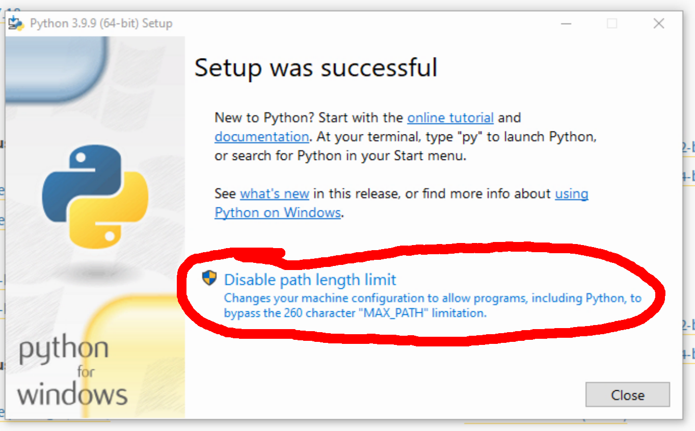

Mutagen Tabletop RPG Engine
---------------------------

This is the Mutagen Game Engine. It defines basic rules for an
open-source, fiction-first tabletop roleplaying game. It has several
features I consider unique or outstanding:

* Mutagen puts fiction first. Everything in the game is designed to
  help your table tell an exciting and surprising story
  together. "Balance" be damned.

* There's no separate rulebook or character sheet. A "playbook" serves
  as both, providing all the rules and recordkeeping that the person
  using it needs. Each player and the GM gets a playbook with exactly
  what's relevant to their role, and each game has custom playbooks
  containing just what's necessary.

* Made up of modular sections, playbooks are short and
  self-contained. For most games and playbooks, players get 5-6 pages.
  The GM playbook might be twice as long. Other than lore, nobody
  needs to read anything else.

* Mutagen is low-stress for players. The rules are brief, and printed
  right on your character sheet for easy reference. Mark Health right
  next to the description of Health.

* Mutagen is fun for GMs. Players owning the narrative means you can
  go with the flow--without risk of drowning. Throw fun problems at
  your PCs without needing to pre-balance everything. Find out what
  happens along with them!


# Raw Mutagen

While Mutagen shines with custom playbooks, you can run a dope-ass
game with just the vanilla Meta and Common Mutagen playbooks, without
any specialized moves. These core playbooks define rules in terms of a
few universal concepts and narrative goals that apply to most RPG
scenarios, not in terms of what a character can specifically do.

In a Raw Mutagen game, each PC mostly has access to the same powers
and resources as the others--however you define that in your
world. PCs can grow and get better at doing stuff with those powers,
but they don't have moves that would let them defy reality differently
than other PCs. Basically, they do whatever people (or whatever) can
do in your world to drive a story forward. If that's driving oxen or a
spaceship, it doesn't matter much for the rules.

This works great playing "mundane" games, no matter what that means in
your world. If your PCs are "regular" acid-spitting trans-Plutonian
gene truckers, Raw Mutagen will take you to the stars. You need
specialized moves or playbook sections when different PCs gain access
to significantly different or unique in-game powers. They define the
exceptions to your norm.


# Playing with Mutagen

* Mutagen uses dice. Random chance helps us tell surprising stories at
  the table. And rolling dice is fun.

* Mutagen is genre-blind and tone-blind, with the core playbooks
  written in universal narrative terms.

* Mutagen may be short, but it's deep. Because it's fiction first,
  Mutagen doesn't fill pages with rules just to have cool stuff. It
  just fills pages with cool stuff. Different playbooks permit wildly
  varied playstyles within the same game, and wide choice in moves and
  their application gives everybody options.

* Mutagen works for campaigns. I've written it tersely as possible to
  get out of the way; but it's designed to support full-length,
  full-engagement campaigns. Bought every ○ in your playbook?  Make up
  some new epic-tier moves.

* Mutagen works for one-shots. Most people can read the rules in
  about 10 minutes if they aren't interrupted, and explore the rest of
  their playbooks in another 10 minutes. So long as the game's premise
  is simple enough, many GMs can get a group playing in half an hour.

* Mutagen is awesome for no-show/impromptu one-shots. When missing a
  player, lots of us turn to one-page mini RPGs or boardgames. But if
  everybody already knows Mutagen, you can get a one-shot going in no
  time just by referencing some common media you've all seen and
  playing Raw Mutagen in that world. "Hey, Art's out. Has everyone
  read some Discworld? Make up a concept for a city guard 'cause I've
  got an idea."

# Building with Mutagen

Mutagen is designed from the ground up to support modular additions in
the form of new moves and playbook sections. Because the flexible
_story moves_ system resolves risk and conflict in the story, you
don't need to include those kinds of considerations when designing a
move. A move can be as simple as "○ Speak to Animals - You can speak
to and understand animals."

You can add moves piecemeal as much as you want (that's how I built
and refined Mutagen), but you might want to make a whole game world's
worth of moves and playbook sections, presented coherently like the
example playbooks. I call this a "mutation". A mutation is
self-contained and suitable for distribution directly to your players.

In addition to everything above, here's why you might want to build
your game or homebrew with Mutagen:

* The Mutagen core (4 pages total for the Meta and Common playbooks)
  is ready to go to out of the box to handle anything "normal"--no
  matter what normal means in your world.

* Layer in character progression, specialization, and differentiation
  through new playbook sections without rewriting anything. Easily
  represent playable "classes", tropes and archetypes, or even unique
  iconic characters.

* Homebrew is first class. You can play Raw Mutagen plus a few custom
  moves you make up and jot on notepaper before or during the game
  sessions. Formalize things into playbooks when you're ready; or
  don't.

* There's meta-meta support. :) There's a Designer playbook which
  might help you get into the Mutagen headspace when writing a game or
  homebrew using the system. There's also a simple automation
  framework for piecing together multiple playbooks into seamless
  final documents for your players--if you're a computer nerd like me.

* It's open source, even for commercial use. The core Mutagen system
  and several example playbooks are available for your own use,
  without asking permission, even for commercial purposes--with
  certain restrictions. You can protect your lore, world, art, merch
  and stuff under regular trade law. See "Copyright and License" below
  for more.

FAQ
---

### I thought it was self-contained.

That is not a question, but I take the rhetorical point. I'm doing my
best to define everything in the core playbooks as clearly as I
can. But given the extreme space constraints, I usually only get 1
shot at defining a concept. While I've tried to pick framing and style
so that most people understand what I'm writing, I know my description
can't work for everybody. These FAQs are requests I've received for
clarification from some portion of players, but not so many that I
want to revise the rules themselves--or maybe I just haven't thought
of a better solution.

### No questions?

I just eliminated the only major confusion feedback I've gotten. Go
back in the repo to see what I'm talking about if you care enough. I'm
sure there'll be more later.


# Building Playbooks

You can manually build full playbooks from their sections using
LibreOffice, however it's much easier to use the included build
system. Not only will it build pretty, integrated PDFs; but if you
follow the exact formatting/symbol conventions in the core sections,
it'll also create an electronic playbook template for use in the
(upcoming) Mutagen character tracker app.

The build is tested on Ubuntu Linux and Windows 10 Home. I expect the
Linux instructions can be used with only a little modification on Mac,
but I don't have one and haven't tested it.


### Linux Prereqs:

1. Make sure you have python3 installed. This is included on most
   modern systems.

2. Do `pip3 install pypdf2`.

3. Install LibreOffice 6.0 or higher.


### Windows Preqs:

1. Download Python 3.9 or higher from the official website
   (https://www.python.org/downloads/windows/). Use the version that
   says "Download Windows installer" (_not_ "embeddable package").

2. IMPORTANT! Check the box that says "Add Python 3 to PATH".
   

3. IMPORTANT! On the last step of the installer, click the option that
   says "Disable path length limit".
   

4. Open `cmd` to get a command prompt. Type `pip3 install pypdf2` and
   hit enter. That might complain about an old version of `pip`, but
   don't worry about it so long as it says that pypdf2 was
   successfully installed.

5. Install LibreOffice 7.0 or higher.
   IMPORTANT! Install LibreOffice in the default location.
   (https://www.libreoffice.org/download/download/)


### Playbook Definitions

Playbooks are made up of multiple sections, each as a separate
document. The playbook definition file tells the script which sections
go together into which playbooks. Look at the included `playbooks.txt`
for an example.

Each line of the file consists of a final playbook filename, then an
equal sign, then a list of each playbook section in the order they go
into that playbook. The Mutagen Meta section is _automatically_
appended to the end of every playbook created.

Do NOT! include the extension (`.odt` or `.pdf`) on any of these
file names. All of that is handled automatically.

```
output_name = common/first_section your_game/second_section your_game/third_section
```

You can edit the included `playbooks.txt` or make a new one for your
game.


### Running the Build

Once you've gotten the prereqs out of the way, you should be able to
open a command prompt in the project directory and run the build.


Linux: `./make_playbooks.py`

Windows: `python make_playbooks.py`

If you want to use a different playbook definition file, just put it
at the end like:

Linux: `./make_playbooks.py my_playbooks.txt`

Windows: `python make_playbooks.py my_playbooks.txt`

This will create a bunch of intermediary files in the `build`
directory. You can ignore these.

The complete PDF playbooks are created in `playbook_output`, with the
electronic tracker teplates in a subdirectory.


### Tracker Template Extraction

The playbook builder script also extracts a computer-readable listing
of all moves for each playbook. Each of these is stored in a separate
file with a `.mutagen.json` extension. These files are intended for
use in the (upcoming) digital playbook webapp.

In order for this feature to work correctly, there are some technical
requirements.

1. Use _exactly_ the same symbols as the core sections. You should
   _copy and paste_ the symbols--don't try to do it by sight, because
   many symbols look similar or identical but have different computer
   representations. For your convenience, there is a file
   `unicode_symbols` that has all of the weird symbols used in the
   playbooks.

2. Define every one of your items or moves with `►` after the name. Do
   _not_ use that symbol for any other purpose or in any other place.

3. Include the `§` at the beginning of every section name.

4. Use exactly the included `○△●▢` symbols for buyable and trackable
   items. These are the only "clickable" symbols in the webapp.

5. Avoid complex formatting in move text. Specifically, features like
   tables, images, embedded spreadsheets, and all the other fancy shit
   LibreOffice can do will break when the playbook is converted to
   plain text for automatic parsing. Keep it simple.


Copyright and License
---------------------

Copyright 2021 by Aubrey R. Jones.

The work contained in this repository is licensed under the Creative
Commons Attribution-ShareAlike 4.0 International License. To view a
copy of this license, visit
http://creativecommons.org/licenses/by-sa/4.0/ or send a letter to
Creative Commons, PO Box 1866, Mountain View, CA 94042, USA.


### CC Share Alike? I thought you said commercial was cool!

Okay, stay with me for a minute. I've been hacking away at this engine
for, like, a lot of hours now. I've got all the general rules to tell
an exciting adventure story cut down to 4 pages that work unchanged
for (most) any world. Even if you knew you'd license an engine, did
you expect to get it down to 4 pre-written pages?

What's more, you don't even have to print those pages in your
book. You're gonna publish them in PDFs just like you'd planned for
your character sheets. Character sheets you're not gonna have to
design anymore--although of course you can tart them up if you've got
the budget. You also get free modular document generation and
automatic, seamless, free integration into the Mutagen Character
Tracker app.

Unless you want to, you don't have to publish any mechanical rules in
your book. You can fill every page with the awesome fruits of your
imagination without wasting anything on how tables play out the next
narrative beat. Or you can cut your page count and widen your margin.

If you don't screw it up, you're going to write 1-2 pages for the
playbook representing each class or whatever in your game. And since
there's literally no space for lore or worldbuilding in those measley
columns, they're gonna be almost 100% game mechanics.

Finally you've got to remember: this is a fiction first game, so the
'game mechanics' just call right back into the fiction anyway. That'd
be the book you're selling. [Or actually it could be a movie, a novel,
Patreon serial, or any other media you're making. I'd love to see some
author publish playbooks to go with their novel--DM me, I'll help.]

So check it out: in your book, which you're publishing for cash moneys
and claim trad copyright on, you describe this dope-ass creature you're
calling a Mana Guppy. You tell your readers all about the crazy shit
it can do, how it looks, what it expects from its chosen Guppy
Tender. That's all in your book with trad copyright. Within the law,
ain't nobody gonna yoink your Mana Guppy.

Then in a completely separate PDF you were gonna give away anyway,
you'll put a line in the Guppy Tender playbook that's like `○ Summon
Mana Guppy - Spend 1 Guppy Bait. If the conditions are right, you
summon your Mana Guppy.` And you're telling me--the guy giving you a
free game engine you don't pay to print--that you can't even share
*that much*?


