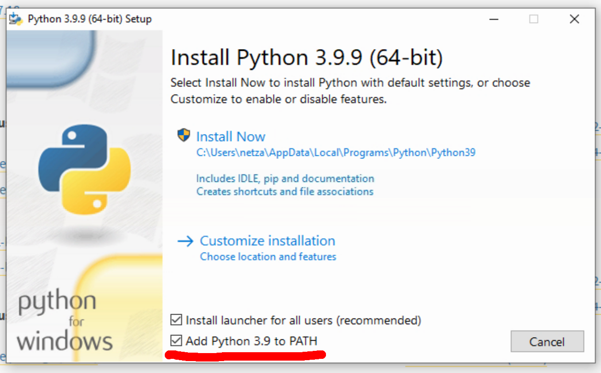
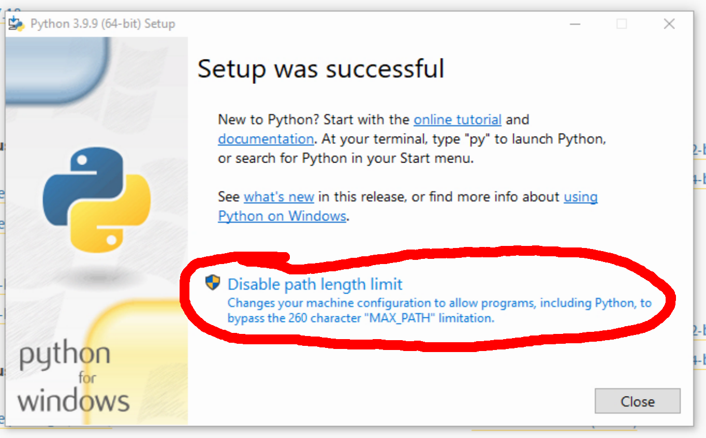

Mutagen Tabletop RPG Engine
---------------------------

This is the project page for the Mutagen Tabletop Game Engine. If
you're a player or a GM, you probably want [the Mutagen
website](https://www.mutagenrpg.com). This page is primarily meant for
homebrewers and designers.

Mutagen is a little different from other tabletop engines you might
have met. It's a whole ecosystem. There are three main parts:

  * The flexible, extensible, fiction-first core rules.
  * The document generation system contained in this project.
  * The `mutagenrpg.com` website, which provides a web-app for live
    character sheets.

Design philosophy for the rules themselves are in files under the
`designer` directory.

The document generation system is described below. It creates PDF
playbooks for printing and electronic playbooks for use on the
website.

The `mutagenrpg.com` website lets players upload the electronic
playbooks created by the document generation system, edit write-in
fields, toggle purchased powers, etc. 


# High Level Overview

Publishing with Mutagen is easy.

  1. Write and distribute your fiction, world, and setting using 
     whatever publishing techniques you favor.

  2. Write a 1-2 page playbook for each playable class or archetype
     in your game. You'll write this using Mutagen Markup to mark 
     formatting and structure.

  3. Run the automatic document builder from this project.

  4. Distribute the playbook PDFs to your players however you'd 
     intended to publish electronic character sheets anyway.

  5. Your players can print their PDF to use offline, or they can upload 
     it directly to `mutagenrpg.com` and use the electronic playbook 
     that was automatically generated and attached by the document 
     builder.


# Building with Mutagen

Mutagen is designed from the ground up to support modular additions in
the form of new moves and playbook sections. Because the flexible
_story moves_ system resolves risk and conflict in the story, you
don't need to include those kinds of considerations when designing a
move. A move can be as simple as "○ Speak to Animals --> You can speak
to and understand animals."

You can add moves piecemeal as much as you want (that's how I built
and refined Mutagen), but you might want to make a whole game world's
worth of moves and playbook sections, presented coherently like the
example playbooks. I call this a "mutation". A mutation is
self-contained and suitable for distribution directly to your players.

In addition to everything above, here's why you might want to build
your game or homebrew with Mutagen:

* The Mutagen core (4 pages total for the Meta and Common playbooks)
  is ready to go to out of the box to handle anything "normal"--no
  matter what normal means in your world.

* Layer in character progression, specialization, and differentiation
  through new playbook sections without rewriting anything. Easily
  represent playable "classes", tropes and archetypes, or even unique
  iconic characters.

* Homebrew is first class. You can play Raw Mutagen plus a few custom
  moves you make up and jot on notepaper before or during the game
  sessions. Formalize things into playbooks when you're ready; or
  don't.

* It's open source, even for commercial use. The core Mutagen system
  and several example playbooks are available for your own use,
  without asking permission, even for commercial purposes--with
  certain restrictions. You can protect your lore, world, art, merch
  and stuff under regular trade law. See "Copyright and License" below
  for more.


# Downloading the Project

You can download a snapshot of the project with [this download
link](https://github.com/aubreyrjones/mutagen/archive/refs/heads/main.zip).

This project is hosted on
[github](https://github.com/aubreyrjones/mutagen/). If you know `git`,
you can just clone the repository from that URL. If you don't know
`git`, there are vast advantages to learning it, but that's beyond the
scope here.


# Generating Documents

The core of the Mutagen ecosystem is the document builder. This Python
script is responsible for taking all the individual sections of your
game's playbooks, formatting them, and turning them into unified
documents and online character sheets.

There's a little setup and a bit of a learning curve, but running the
document builder itself is very easy. Double-click on the script and
it generates final PDFs and electronic character sheets ready for
distribution to your players. It's all free/open-source software, so
you don't need to pay anybody or download weird demo versions.

You write Mutagen playbooks mostly using Mutagen Markup. Consisting of
some special formatting codes, Mutagen Markup lets the document
builder automatically format player playbooks into PDFs. The same
information lets the builder extract the data necessary to power the
online character tracker app.

The document builder is tested constantly on Ubuntu Linux and
regularly on Windows 10 Home. I expect the Linux instructions can be
used with only a little modification on Mac, but a tale old as time: I
don't have one and haven't tested it.


## Linux Prereqs:

1. Make sure you have `python3` installed. This is included on most
   modern distros.

2. Do `python3 SETUP.py`. This rarely fails on a functional Linux
   system connected to the internet.

3. Install LibreOffice 6.0 or higher. I suggest just using your
   package manager.

4. Install the `MutagenSans.ttf` and `MutagenSansBold.ttf` fonts from
   this repository.


## Windows Preqs:

1. Download and install Python 3.9 or higher from the official website
   (https://www.python.org/downloads/windows/). Use the version that
   says "Download Windows installer" (_not_ "embeddable package").

2. IMPORTANT! Check the box that says "Add Python 3 to PATH".
   

3. IMPORTANT! On the last step of the installer, click the option that
   says "Disable path length limit".
   

4. Double-click `SETUP.py`.

   This will download some requirements and tell you if they were
   successfully installed. If it doesn't work, it's typically because
   of a mistake in one of the steps above, or because of something
   like anti-virus or other intrusive software.

5. Install LibreOffice 7.0 or higher. IMPORTANT! Install LibreOffice in the 
   default location on your computer.
   (https://www.libreoffice.org/download/download/)  

6. Install the `MutagenSans.ttf` and `MutagenSansBold.ttf` fonts from
   this repository.


## Running the Build

Once you've gotten the prereqs out of the way, you should be able to
run the build.

If your playbook definitions are in `playbooks.txt`, you can just:

Linux: Run `./compile_playbooks.py` from the command line.

Windows: Double-click `MAKE_PLAYBOOKS.bat`. Bypass whatever silly security 
warning pops up. You trust me, right?


If you want to use a different playbook definition file:

Linux: `./compile_playbooks.py my_playbooks.txt`

Windows: Drag and drop your playbook definition file onto `MAKE_PLAYBOOKS.bat`.


Windows Pro Tip: It's not required, but your playbook builds will go a
*LOT* faster (10x) if you open a copy of LibreOffice Writer before you
run the build and leave it open while the build runs. You can just
have a blank document in there with the window minimized.

The build will create a bunch of intermediary files in the `build`
directory. You can ignore these.

The complete PDF playbooks are created in `playbook_output`.

For playbooks including Mutagen Markup, the electronic playbook is
included as an internal attachment to each PDF file. You only need
to distribute the unaltered PDF to enable full compatibility with
the Mutagen ecosystem.

GMs and players upload the PDF playbook directly to the online 
character tracker app to view the playbook or create a character. 
You don't need to involve me. This autonomy is one of the major 
benefits of the Mutagen system.

The document builder also creates a `tracker_templates.zip` file
including all the electronic playbooks as raw files. You can send me
that file if you'd like your playbooks included in the [the character
creation list](https://www.mutagenrpg/all) on the main website.

Errors might be a bit cryptic right now. Sorry. :( Usually they're
related to formatting paragraphs or write-in fields. Look for the
error in the last file that it says it's processing. Usually there are
clues for the kind of thing that screwed up in the error output.


## Playbook Definitions

Playbooks are made up of multiple sections, each as a separate text
file or document. The playbook definition file tells the script which
sections go together into which playbooks. Look at the included
`playbooks.txt` for an example.

Some lines of the file consist of definitions for the publishing
engine. They look like an ALL CAPS name and a text value, separated 
by an equals sign. They look like this:

```
AUTHOR = © 2021 Aubrey R. Jones 🄯 CC-BY-SA 4.0
```

Most lines of the file define a new playbook. They consist of a 
human-friendly playbook name, an equals sign, final playbook 
filename, another equals sign, then a list of each playbook section 
in the order they go into that playbook.

```
Friendly, Human Readable Playbook Name = output_file_name = common/first_section your_game/second_section your_game/third_section
```

The Mutagen Meta section is _automatically_ appended to the end of
every playbook created, both player and GM. The Meta section is
omitted if the filename contains `_teaser`.

Do NOT! include the extension (`.txt`, `.odt`, `.pdf` etc) on any of
these file names. All of that is handled automatically.

You can edit the included `playbooks.txt` or make a new one for your
game.

Each playbook can contain a mix of sections written as either `.txt`
or `.odt` files. THEY ARE TREATED VERY DIFFERENTLY.

Text files are assumed to contain Mutagen Markup. They are parsed by
the document builder, then automatically formatted as player playbook
sections. Additionally and critically, the sections and moves are
encoded for use in the online character tracker app.

Pre-formatted ODT documents are ONLY INCLUDED IN THE PDF EDITION of
the playbook. They are converted to PDF as-is and included in the
final playbook PDF, but _they are NOT encoded for the online tracker_.

In general, playbooks should be written in Mutagen Markup
so that it's compatible with the online character tracker. Inside of
playbooks, use ODT sections never or rarely; and then only for flavor, 
fiction, and informational material that doesn't need to be tracked or 
routinely referenced after a first play session.

Keep in mind that the online character tracker provides substantial
accessibility support for GMs and players using assistive technology.
Writing playbooks in Mutagen Markup means that what you've written will 
be available to the widest audience possible.


## Mutagen Markup

Mutagen Markup is made up of some special formatting codes and unicode
symbols that you use to tell the document builder how to interpret
your playbook sections. There's a reference in
`unicode_symbols.txt`. You can also look at the included
`common/common.txt` and `pcs/*.txt` files for extensive examples, but
here's a short one taken from `pcs/sorcerer.txt`:

```
$ Sorcerer Resources

Will --> The overwhelming conviction that your magic should override the very laws of reality.
|● 1. ▢ ▢ ▢ 
|○ 2. ▢
|○ 3. ▢
```

While it's a little weird at first, writing playbooks with Mutagen
Markup is ultimately a _lot_ faster and more consistent than using a
word processor to manually build each one. You spend zero time fucking
around with margins and fonts in the word processor, so there's more
time for writing down the cool moves you invent.

It's also nice when several different playbooks share sets of moves,
since you can just write them once and include them in each relevant
playbook. Doing this with "master document" style word processor
workflows is tedious and prone to breakage.


### Text Editors

You need a good quality text editor, not a word processor. While you
could use built-in Notepad, I would recommend an open-source text
editor like:

  * [Atom](https://atom.io/)
  * [Notepad++](https://notepad-plus-plus.org/)

You absolutely should _not_ use Word or LibreOffice to edit the
playbook section `.txt` files. They'll mangle the text files.


### Paragraph Formatting

Inside Mutagen Markup, each new line is considered a new
paragraph. Some paragraphs are special, like line items (starting with
a `*`) or result outcomes (starting with one of `🡕🡒🡖🡐`). But most
lines of markup are just formatted as a new paragraph of regular text
with a uniform separation between them.

Extra blank lines between paragraphs in the markup are ignored, so you
can separate your paragraphs with multiple lines while you're writing
them in the `.txt` file. You can also add comments by starting a line
with `##`; comment lines are skipped and ignored by the publishing
engine.

I suggest turning on the "soft word wrap" (sometimes just "word wrap")
feature in your text editor so that paragraphs extending over very
long lines are visually (but not actually) wrapped around for easier
reading. This is often in the "view" or "document" menu.

You can also explicitly continue a paragraph into a new line by starting 
the new line with `\`. This will force the text on the new line to be 
treated as part of the preceding paragraph.

If you want to insert a line break, but not have a regular paragraph
separation (useful for outlining ranks of resources for instance), you
can start the line with `|`. This will still separate that line as a
new paragraph, but it will have a much smaller physical space from the
preceding paragraph.


### Sections and Moves

There are two basic blocks of text you can format:

  * sections
  * moves

Section names start with `§` or `$`. Optionally, you can write `~~~§`
or `~~~$`, which will force a column-break before that section in the
PDF playbook. You can write paragraphs of text underneath the section
name to describe the section's contents. [Don't use write-in 
fields or clickable symbols inside of section descriptions. They won't 
work right in the app.]

Moves start with a paragraph containing `-->` or `►`. Do not use that
symbol anywhere else or for any other purpose. Everything before the
arrow (including clickable symbols) is considered the move's
header. Everything after the arrow is considered that move's
description. Every following paragraph is considered part of that
move, until you start a new move or section.


### Notes/Recap 

1. When using a unicode symbol, use _exactly_ the same symbol as in
   `unicode_symbols.txt`. You should _copy and paste_ the
   symbol. Don't try to do it by sight, as many unicode symbols look
   similar to others; and the same symbol can look different between
   different fonts.

2. Define every one of your items or moves with `-->` or `►` after the
   name. Do _not_ use that symbol for any other purpose or in any
   other place.

3. Include the `§` at the beginning of every section name. If you
   don't, the section won't be recognized.

4. Use exactly the included `○△▢` symbols for buyable and trackable
   items. These are the only "clickable" symbols in the app.

5. Use the same format for aptitudes as in the core sections, with the
   `○` on either side of the aptitude name and the `►` after the last
   `○`: `○ APT_NAME ○ ○ ○ ►`. The number of `○` after the name isn't
   important; but use only 1 before the name.

6. Avoid complex formatting in move text. It won't translate.

7. For write-in text inputs (places where players are expected to put
   notes), carefully follow the format shown in the Common Resources
   and Wizard Concentration items. Use the two-line example for items
   where the player only needs to write a couple words. Use 4+ lines
   for a sentence.

   Labeled inputs (like Concentration) must follow the exact 3-line
   formula. Horizontal spacing is not important, but the lines are.
   The first line has the bracket-top characters; the second line has
   the label; the third line has the bracket-bottom characters.


Copyright and License
---------------------

Copyright 2021 by Aubrey R. Jones.

The work contained in this repository is licensed under the Creative
Commons Attribution-ShareAlike 4.0 International License. To view a
copy of this license, visit
http://creativecommons.org/licenses/by-sa/4.0/ or send a letter to
Creative Commons, PO Box 1866, Mountain View, CA 94042, USA.


### CC Share Alike? I thought you said commercial was cool!

Okay, stay with me for a minute. I've been hacking away at this engine
for, like, a lot of weeks now. I've got all the general rules to tell
an exciting adventure story cut down to 4 pages that work unchanged
for (most) any world. Even if you knew you'd license an engine, did
you expect to get it down to 4 pre-written pages?

What's more, you don't even have to print those pages in your
book. You're gonna publish them in PDFs just like you'd planned for
your character sheets. Character sheets you're not gonna have to
design anymore, since they're automatically generated. You also get
free, seamless integration into the Mutagen Character Tracker app.

Unless you want to, you don't have to publish any mechanical rules in
your book. You can fill every page with the awesome fruits of your
imagination without wasting anything on how tables play out the next
narrative beat. Or you can cut your page count and widen your margin.

If you don't screw it up, you're going to write 1-2 pages for the
playbook representing each class or whatever in your game. And since
there's literally no space for lore or worldbuilding in those measly
columns, they're gonna be almost 100% game mechanics.

Finally you've got to remember: this is a fiction-first game, so the
'game mechanics' just call right back into the fiction anyway. That'd
be the book you're selling. [Or actually it could be a movie, a novel,
Patreon serial, or any other media you're making. I'd love to see some
author publish playbooks to go with their novel--DM me, I'll help.]

So check it out: in your book, which you're publishing for cash moneys
and claim trad copyright on, you describe this dope-ass creature you're
calling a Mana Guppy. You tell your readers all about the crazy shit
it can do, how it looks, what it expects from its chosen Guppy
Tender. That's all in your book with trad copyright. Within the law,
ain't nobody gonna yoink your Mana Guppy.

Then in a completely separate PDF you were gonna give away anyway,
you'll put a line in the Guppy Tender playbook that's like `○ Summon
Mana Guppy --> Spend 1 Guppy Bait. If the conditions are right, you
summon your Mana Guppy.` And you're telling me--the guy giving you a
free game engine you don't pay to print--that you can't even share
*that much*?


# Acknowledgements and Thanks

Games that inspired Mutagen: _Blades in the Dark_, _Scum & Villany_,
_Apocalypse World_, _GURPS_, _Vampire: the Masquerade_.


Thanks to:

* K for endless test reading.

* L for endless enthusiasm and encouragement.

* My online table: H, L, and K for being my first guinea pigs.

* My kitchen table: E, Z, K, and B 'cause they didn't sign up for this
  shit.

